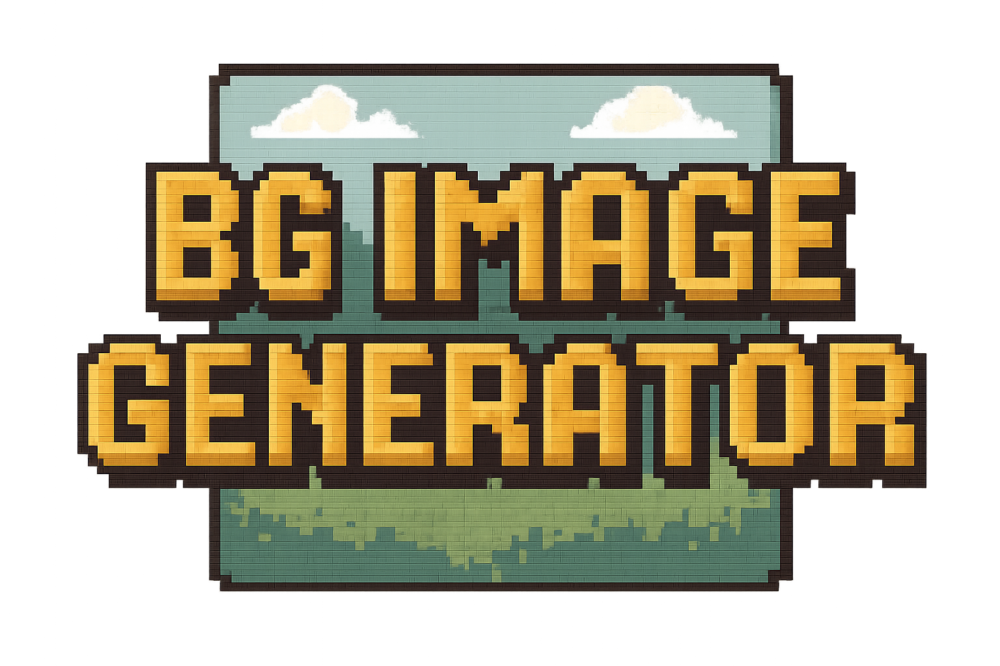

<p align="center">
  
</p>

<h1 align="center">BG Image Generator</h1>

<p align="center">
  A browser-based tool for batch generating images from CSV data using OpenAI's image generation API.<br>
  Built for board game designers, indie publishers, and creative prototypers.
</p>

<p align="center">
  <a href="https://lajlev.github.io/bg-image-generator/">Live Demo</a> · <a href="https://lajlev.github.io/bg-image-generator/tutorial.mp4">Watch Tutorial</a>
</p>

---

## What is this?

BG Image Generator lets you define a **master prompt** with placeholders, upload a **CSV file** with your data, and generate images for every row — all from your browser. No server, no backend, no install.

It was designed with board game prototyping in mind: generate card art, map tiles, box covers, or any batch of images where the content varies but the style stays consistent.

## Features

### Prompt templating
Write a master prompt using `{{column_name}}` placeholders that get replaced with values from each CSV row.

```
A fantasy card illustration of {{character_name}}, a {{class}} 
wielding {{weapon}}. Digital painting, dramatic lighting.
```

### CSV-driven batch generation
Upload a CSV file and the app generates one image per row. Click any column tag to insert it into your prompt — no need to remember column names or type the curly braces.

### Model & size selection
Choose between OpenAI's image models, each with their supported sizes:

| Model | Sizes | Price per image |
|-------|-------|-----------------|
| **gpt-image-1** | 1024x1024, 1536x1024, 1024x1536, Auto | $0.04 – $0.08 |
| **DALL-E 3** | 1024x1024, 1792x1024, 1024x1792 | $0.04 – $0.08 |
| **DALL-E 2** | 256x256, 512x512, 1024x1024 | $0.016 – $0.02 |

The size dropdown updates automatically based on the selected model — you'll only see valid options.

### Cost estimation
A live cost estimate updates as you change the model, size, and number of rows. Know what you'll spend before you click Generate.

### Row limiting
Generate just the first row to test your prompt, a handful to review the style, or all rows for the final batch. A stop button lets you abort mid-run.

### Filename patterns
Customize download filenames using the same `{{column}}` syntax plus `{{rowNumber}}`:

```
card-{{character_name}}-{{rowNumber}}
```

### Prompt history
Save your master prompts to localStorage and reload them later. Each saved prompt remembers the model and size settings too.

### Image lightbox
Click any result card to view the full-size image with its resolved prompt.

### Download all
One-click download of all generated images as PNGs with your custom filenames.

### Board game sample datasets
Three built-in sample sets to try immediately — no CSV needed:

- **Character Cards** — Fantasy RPG characters with varied art styles
- **Map Tiles** — Top-down terrain tiles with mood and season
- **Box Covers** — Game box art with title, genre, and scene descriptions

### Board game flavor text
While images generate, enjoy 130+ rotating quotes and references from the BGG Top 100 and beyond. Because waiting should be fun.

## Getting started

### 1. Open the app
Visit [lajlev.github.io/bg-image-generator](https://lajlev.github.io/bg-image-generator/) or open `index.html` locally.

### 2. Enter your OpenAI API key
Paste your key and click **Save Key**. It's stored in your browser's localStorage — never sent anywhere except directly to the OpenAI API.

Don't have a key? Expand the "How do I get an OpenAI API key?" section in the app for step-by-step instructions and a video walkthrough.

### 3. Write a prompt or choose a sample
Write a master prompt with `{{placeholders}}` matching your CSV column names, or pick one of the built-in sample sets to get started instantly.

### 4. Upload your CSV
Upload a CSV file or select a sample. The app previews your data and shows clickable column tags you can click to insert into your prompt.

### 5. Generate
Set the number of rows to generate, review the cost estimate, and click **Generate**.

## CSV format

Standard comma-separated values with a header row:

```csv
character_name,class,weapon,art_style
Shadow Thief,Rogue Assassin,twin daggers,Dark Fantasy
Iron Guardian,Dwarven Paladin,war hammer,Classical Oil Painting
Storm Caller,Elven Mage,lightning staff,Watercolor
```

- The first row defines column names (used as `{{placeholders}}`)
- Quoted fields and escaped quotes are supported
- The app previews the first 5 rows after upload

## Privacy & security

- **Your API key stays in your browser.** It's stored in localStorage and sent directly to the OpenAI API via HTTPS. There is no backend server.
- **No data collection.** The app is static HTML/CSS/JS hosted on GitHub Pages. Nothing is tracked, logged, or sent to third parties.
- **No cookies.** Only localStorage is used for the API key and prompt history.

## Tech stack

Zero dependencies. Zero build steps.

- Vanilla HTML, CSS, and JavaScript
- OpenAI Images API (`/v1/images/generations`)
- Hosted on GitHub Pages

## Running locally

```bash
# Clone the repo
git clone https://github.com/lajlev/bg-image-generator.git

# Open it
open bg-image-generator/index.html
```

Or use any local server:

```bash
cd bg-image-generator
python3 -m http.server 8000
# Visit http://localhost:8000
```

## Use cases

- **Board game prototyping** — Generate card art, tokens, tile illustrations for playtesting
- **Tabletop RPG assets** — Batch-create character portraits, item icons, location art
- **Marketing materials** — Product mockups, social media images with varied copy
- **Creative exploration** — Test prompt variations across a matrix of parameters
- **Educational projects** — Illustrate flashcards, worksheets, or learning materials

## License

MIT

---

<p align="center">
  <i>Built with board gamers in mind. Now go generate some art and playtest something!</i>
</p>
